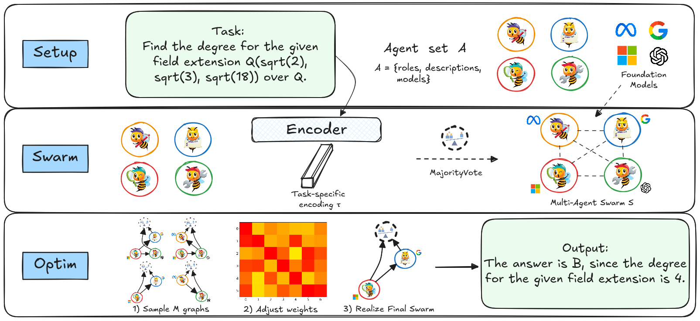
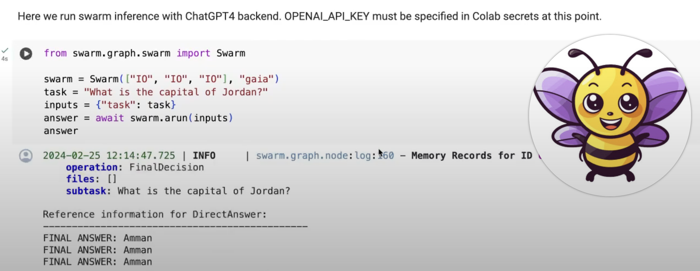
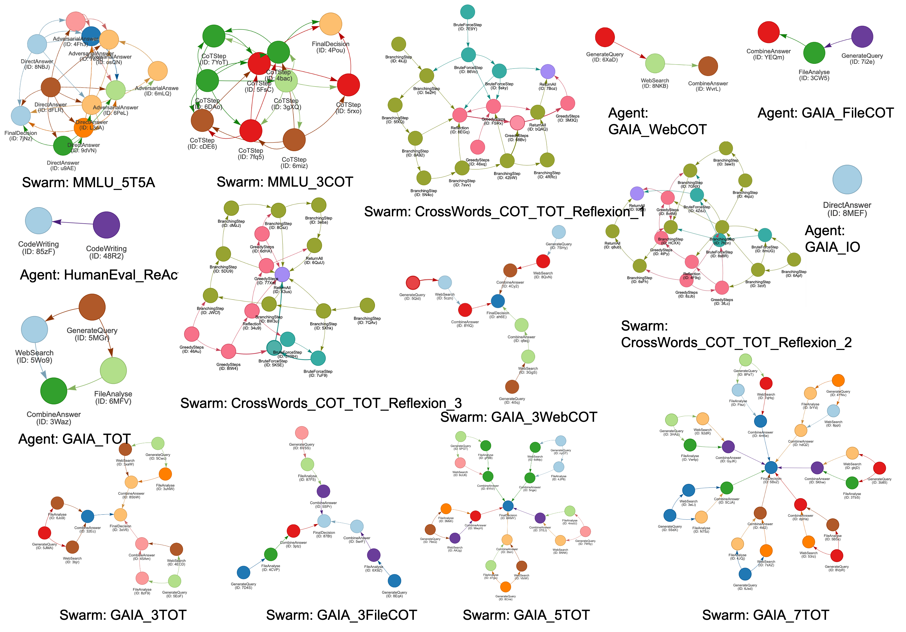

<!-- [](https://gptswarm.org)
[](https://arxiv.org/abs/2402.16823)
[](https://github.com/metauto-ai/GPTSwarm/blob/main/LICENSE)
[](https://github.com/metauto-ai/gptswarm/issues)
[](https://twitter.com/AI_KAUST)
[](https://metauto.ai/images/wechat.jpeg)
[](https://coveralls.io/github/metauto-ai/GPTSwarm?branch=main) -->

🐝 **HiveMind is a graph-based framework for LLM-based agents, providing two high-level features:**

* It lets you build LLM-based agents from graphs.
* It enables the customized and automatic self-organization of agent swarms with self-improvement capabilities, following the evolutionary theories of Charles Darwin and Jean-Baptiste de Lamarck.

<p align="left">
<a href=""></a>
</p>

## Edge optimization example

Here is the edge optimization process that updates edge probabilities toward improvement of the benchmark score. Notice that within an agent, the edges are fixed, whereas the inter-agent connections are getting optimized towards either edge pruning (value 0, red) or creation (value 1, yellow).


## About HiveMind


At a granular level, HiveMind is a library that is built on [GPTSwarm](https://github.com/metauto-ai/GPTSwarm) and includes the following components: 


| Module | Description |
| ---- | --- |
| [**swarm.environment**](swarm/environment) | Domain-specific operations, agents, tools, and tasks |
| [**swarm.graph**](swarm/graph) | Graph-related functions for creating and executing agent graphs and swarm composite graphs |
| [**swarm.llm**](swarm/llm) | Interface for selecting LLM backends and calculating their operational costs |
| [**swarm.memory**](swarm/memory) | Index-based memory |
| [**swarm.optimizer**](swarm/optimizer) | Optimization algorithms designed to enhance agent performance and overall swarm efficiency |


## Quickstart

**Clone the repo**

```bash
git clone https://github.com:nmamie/HiveLLM.git
cd HiveLLM/
```

**Install packages**
```
conda create -n swarm python=3.10
conda activate swarm
pip install poetry
poetry install
```

<!-- **You should add API keys in `.env.template` and change its name to `.env`**

```python
OPENAI_API_KEY="" # for OpenAI LLM backend
SEARCHAPI_API_KEY="" # for Web Search
``` -->

**Getting started with HiveMind is easy. Quickly run a predefined swarm**

```python
from swarm.graph.swarm import Swarm

swarm = Swarm(["IO", "IO", "IO"], "gaia")
task = "What is the capital of Jordan?"
inputs = {"task": task}
answer = await swarm.arun(inputs)
```

**or make use of tools, such as the file analyzer**

```python
from swarm.graph.swarm import Swarm
swarm = Swarm(["IO", "TOT"], "gaia")
task = "Tell me more about this image and summarize it in 3 sentences."
files = ["./datasets/demos/js.png"]
inputs = {"task": task, "files": files}
danswer = swarm.run(inputs)
```

<!-- Check out the minimal Swarm example in Colab here: [](https://colab.research.google.com/github/metauto-ai/GPTSwarm/blob/main/notebooks/demo_swarm.ipynb).

See how to create a custom Agent and run a Swarm with it here: [](https://colab.research.google.com/github/metauto-ai/GPTSwarm/blob/main/notebooks/demo_custom_agent.ipynb).

Here is a Youtube video on how to run the demo notebooks:

[](https://www.youtube.com/watch?v=QOLQse5ZBV8&t=8s&ab_channel=GPTSwarm "Running swarm inference") -->


## Experiments


## Class diagram


## Example of the Swarm


<!-- ## More Visualizations



## Running with a local LLM

We support local LM inference via [LM Studio](https://lmstudio.ai). Download their desktop app for Mac or Windows, choose a model from the Huggingface repository and start the server. Use `model_name='lmstudio'` in GPTSwarm code to run with the local LLM.

 -->

## Contributors

<!-- <a href="https://github.com/metauto-ai/gptswarm/graphs/contributors">
  
</a> -->

* [Noah Mamie](https://nmamie.github.io/) (MSc Student @ UZH; RA @ ETHZ)


## Acknowledgements
This work is acknowledging the excellent projects of [GPTSwarm](https://github.com/metauto-ai/GPTSwarm) and [Evolutionary-Reinforcement-Learning](https://github.com/ShawK91/Evolutionary-Reinforcement-Learning).

<!-- 
## Citation
Please cite our paper if you find the library useful or interesting.
```
@article{mamie2024hivemind,
  title={Language Agents as Optimizable Graphs},
  author={Zhuge, Mingchen and Wang, Wenyi and Kirsch, Louis and Faccio, Francesco and Khizbullin, Dmitrii and Schmidhuber, Jurgen},
  journal={arXiv preprint arXiv:2402.16823},
  year={2024}
}
``` -->


